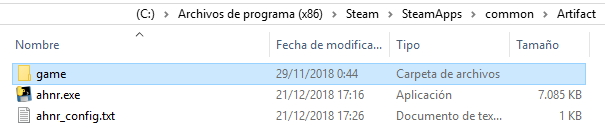
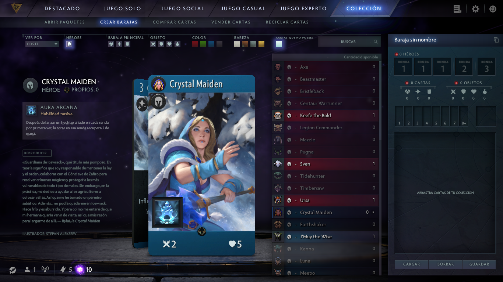

# Guide in other languages:
- [Spanish](guides/spanish/README.md)

# Artifact Hero Names Replacer (AHNR)
Replace Artifact card hero names from a language to other using Artifact API.

For example, if you replace from `spanish` a `english`, you will get **Ax** pass to be **Axe**

Modifications apply to:
-  Cards
-  Lore
-  Cards comments

Repository: `https://github.com/Desvelao/artifact-hero-names-replacer`

__**IMPORTANT**__: read with attention the content of this file. Be sure to have done a **backup** of folder mentioned in the process **Path application** before execute the program.

Download the program from [here](https://github.com/Desvelao/artifact-hero-names-replacer/releases).

Created by [Desvelao^^](https://desvelao.github.io/profile/).
Donations: [Ko-fi](https://www.ko-fi.com/desvelao) or [Patreon](https://www.patreon.com/desvelao).


# Patch application

❗ *Internet is required to access to Artifact API*

0. __**IMPORTANT:**__ It is recommended to do a **backup** (outside game folder) to reset the original files if is needed (or see **Restauration**), of next folders:
    - `Steam/SteamApps/common/Artifact/game/dcg/panorama/localization`
    - `Steam/SteamApps/common/Artifact/game/dcg/resource`

***Note:*** *`Steam` folder is usually at `Program Files(x86)` on Windows.*

1. Unzip the .rar file at `Steam/SteamApps/common/Artifact`.

    

2. Patch configuration: `ahnr_config.txt`
    - **replace_from**: base language to modify th files. It is teh same that is selected to the game. Ej: If you are playing in Spanish, then this is `spanish`.
    - **replace_to**: language to will become hero names. Ex: `english`.
    - **sets**: sets id separated by comas (,). Ex: `00,01`. Remember **add more sets** when these are added to the game, for example `00,01,02`.
    - **files**: relative paths to lacalization files separated by comas (,). Ex: `
        game/dcg/resource/dcg_common_<LANG>.txt,
        game/dcg/panorama/localization/dcg_<LANG>.txt,
        game/dcg/panorama/localization/dcg_glossary_<LANG>.txt
    `
    - **files_sets**: relative paths to lacalization files sets related separated by comas (,). Ex: `game/dcg/resource/card_set_<SETID>_<LANG>.txt,game/dcg/panorama/localization/dcg_lore_set_<SETID>_<LANG>.txt,game/dcg/panorama/localization/dcg_vo_set_<SETID>_<LANG>.txt`

    ***Note:***
    - `<SETID>` set id. Example: 00, 01... They are automatically replaced according to `sets` established at config file `ahnr_config.txt`. To know until that set id there are, see folder mentioned above and see with attention their numeration at file names.
    - `<LANG>` base language to modify the files. This is `replace_from` from `ahnr_config.txt`.

    These placeholders are modify automatically by their related. Don't delete or replace `<SETID>` and `<LANG>` if you don't know what are you doing.

    - Avaliables languages:
        - `brazilian`
        - `english`
        - `french`
        - `german`
        - `italian`
        - `japanese`
        - `koreana`
        - `latam`
        - `russian`
        - `schinese`
        - `spanish`
        - `tchinese`

3. Execute the program.

## Patch results
After program execution, it will show the results of path application to different files to replace:

- ❌ **It is patched:** file was patched before this execution. Pathced files contain at end of its content `//PATCHED` and it is useful to know what taht file was modified.
- ❌ **Without changes:** doesn't find valid replacementfor that file. It will occur in localization files that doesn't contain hero names.
- ✅ **FILE PATCHED:** file was succesfully pathced and added `//PATCHED` to end of this to recognise at after executations.

# Game updates
Game updates can modify localization files where it did replacements, so traduction would lose. You can know if after a game update, modification date of files that you patched previously has changed or see if the text of modified files contain at end `//PATCHED`.

❗ **After a game update, remember reapply the patch to see if some new need to be patched.**

# Restauration
If you need or want to restaurate the originals files after apply the patch, you can:
- restore the backup you did
- verify files integrity
- reinstall the game (as last option)

❗ Care with keep **old backups**, so you restore, if these were before to a game update that added more information to localization files and this isn't find, can raise errors. For this reason, it is recommendedverify files integrity if you want to restore.

## Verify files integrity
From Steam Library, click with right mouse button at Artifact (game) and select `Properties`. Then go to `Local Files` tab and `Verify file integrity`. This will check if your game files are correct and if they aren't, this will download and replace. The patch will be disappear.


# Preview
Ej: replace from `spanish` to `english`.

At config file (ahnr_config.txt):
```
replace_from = spanish
replace_to = english
...
```



# Program errors

If you find a problem with the program, you can report at [issues](https://github.com/Desvelao/ahnr/issues) of this same repository or contact me (on Discord **Desvelao^^#2956**).
